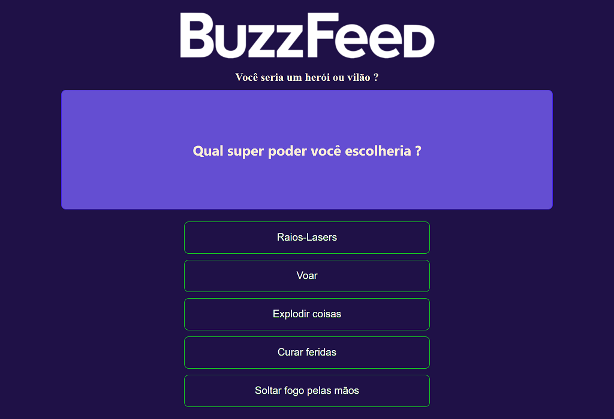

<h1 align="center">
  
</h1>

# Projeto BuzzFeed

Este projeto tem como objetivo utilizar as tecnologias de angular.

A aplicação é um quiz, para saber se o usuário é um 'vilão' ou um 'herói'.

## Tarefas

- Configuração do `resolveJsonModule` e o `allowSyntheticDefaultImports` como verdadeiro no arquivo tsconfig.json.
- Criação de um componente chamado home na pasta pages.
- Criação um componente chamado quiz na pasta components.
- Configuração dos estilos globais da aplicação.
- Adição de pastas no diretório assets; uma chamada `data` e a outra `images`.
- Adição da logo da buzzfeed na pasta de imagem e um arquivo json na pasta de dados.
- Estilização da página
- Criação da lógica da aplicação

## Complemento

- Criação do botão para reiniciar o quiz.
